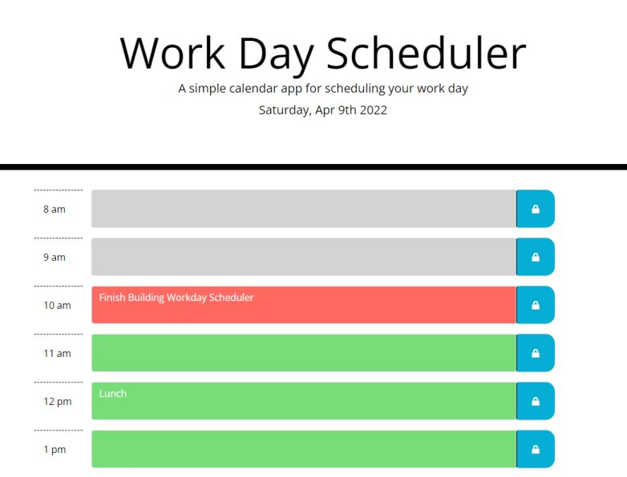

# Work Day Scheduler Starter Code

This is a simple daily planner that will show you your hourly tasks for the day.

It will color code the hour for past, present and future.

### Full Stack Development Languages and Tools used:

### Links
***
GitHub Repository: <https://github.com/Wizzle13/my-daily-planner>

GitHub URL: <https://wizzle13.github.io/my-daily-planner/>